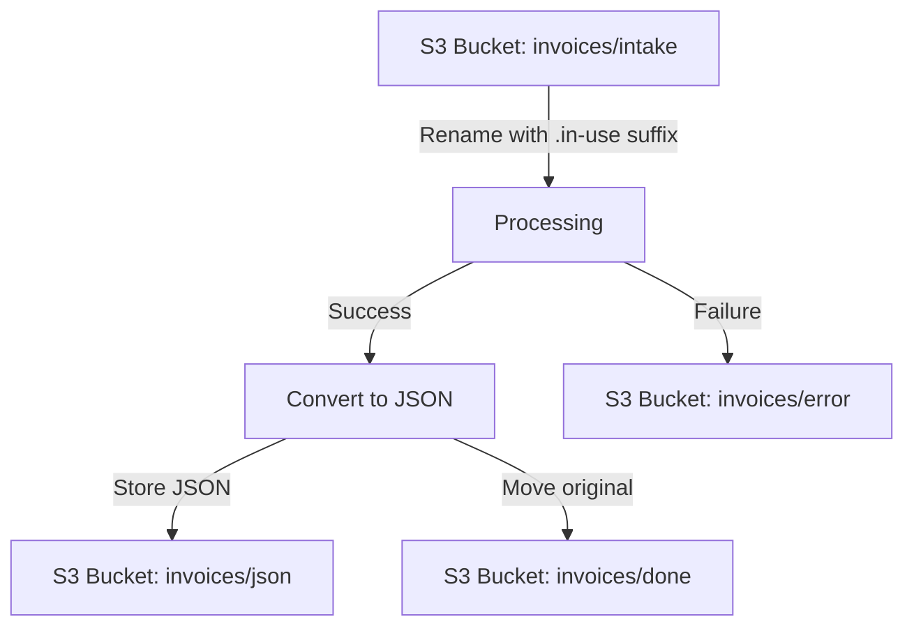
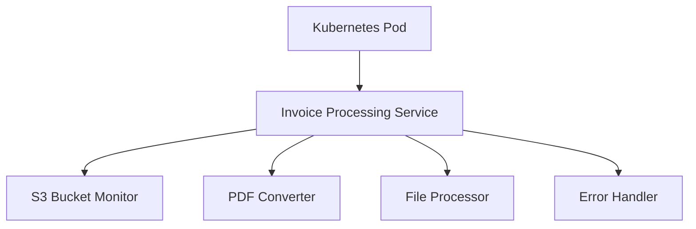

# Invoice Processing System Architecture

## System Overview

This document outlines the architecture for the invoice processing system, which automatically processes PDF invoices from an S3-compatible storage (Minio), converts them to structured JSON format, and manages the workflow of files through different stages of processing.

## Core Components

### 1. S3 Bucket Monitor

- **Purpose**: Continuously monitors the "invoices/intake" prefix in the S3 bucket for new PDF files
- **Implementation**: Uses aioboto3 to poll the S3 bucket at regular intervals (configurable via POLL_INTERVAL environment variable)
- **Behavior**: When a new file is detected, it initiates the processing workflow

### 2. File Processor

- **Purpose**: Manages the lifecycle of files through the system
- **Responsibilities**:
  - Renames files by adding ".in-use" suffix during processing
  - Moves files between different prefixes based on processing outcomes
  - Ensures files are properly tracked throughout the workflow

### 3. PDF Converter

- **Purpose**: Converts PDF files to structured JSON format
- **Implementation**: Uses the docling library (≥2.31.0)
- **Process**:
  1. Downloads PDF from S3
  2. Creates a temporary local copy
  3. Invokes docling's DocumentConverter
  4. Extracts structured data
  5. Formats as JSON with metadata

### 4. Error Handler

- **Purpose**: Manages files that fail during processing
- **Implementation**: Exception handling with detailed error logging
- **Behavior**: Moves failed files to the "invoices/error" prefix

### 5. Monitoring and Logging

- **Monitoring**: OpenTelemetry (OTEL) integration for observability
- **Logging**: Python's standard logging module
- **Metrics**: Processing times, success/failure rates, file counts

## Data Flow

1. **Intake**:
   - PDF files are placed in the "invoices/intake" prefix of the S3 bucket

2. **Processing Initiation**:
   - The system detects new files in the intake prefix
   - Files are renamed by adding a ".in-use" suffix to indicate they're being processed

3. **Conversion**:
   - PDF files are downloaded to temporary storage
   - The docling library converts PDFs to structured JSON
   - JSON files are stored in the "invoices/json" prefix

4. **Completion**:
   - Successfully processed PDFs are moved to "invoices/done" prefix with the ".in-use" suffix removed
   - Failed PDFs are moved to "invoices/error" prefix

## Data Model

The system uses Pydantic models to represent the structured data:

## Deployment

The system is designed to run as a continuous service deployed as a pod on Kubernetes:

### Configuration

The system is configured through environment variables:
- S3_ENDPOINT_URL: URL of the S3-compatible storage
- S3_DEFAULT_REGION: S3 region (default: us-east-1)
- S3_ACCESS_KEY_ID: Access key for S3
- S3_SECRET_ACCESS_KEY: Secret key for S3
- POLL_INTERVAL: Time in seconds between S3 bucket polling operations

### Resource Requirements

- CPU: Moderate (depends on processing volume)
- Memory: Moderate to high (PDF processing can be memory-intensive)
- Storage: Minimal (uses temporary storage for processing)
- Network: Requires access to S3 storage

## Error Handling and Resilience

### Error Scenarios

1. **PDF Conversion Failures**:
   - Invalid PDF format
   - Corrupted files
   - Unsupported features
   - docling library errors

2. **S3 Operation Failures**:
   - Connection issues
   - Authentication failures
   - Permission errors
   - Bucket/prefix not found

1. **Health Checks**:
   - Regular verification of S3 connectivity
   - Monitoring of docling library functionality

## Monitoring and Observability

### OpenTelemetry Integration

- **Traces**: Track processing of individual files through the system
- **Metrics**: Measure performance, throughput, and error rates
- **Logs**: Capture detailed information about system behavior

### Key Metrics

1. **Processing Metrics**:
   - Files processed per minute
   - Average processing time
   - Success/failure rate

2. **Resource Metrics**:
   - CPU usage
   - Memory consumption
   - Network I/O

3. **S3 Metrics**:
   - Operation latency
   - Error rate
   - Bandwidth usage

## Security Considerations

1. **Data Protection**:
   - Temporary files are securely deleted after processing
   - S3 credentials are managed securely

2. **Access Control**:
   - Principle of least privilege for S3 access
   - Kubernetes RBAC for pod security

3. **Network Security**:
   - Secure communication with S3 (TLS)
   - Network policies to restrict unnecessary traffic

## Future Enhancements

1. **Feature Enhancements**:
   - Support for additional document formats
   - Advanced error recovery mechanisms
   - Enhanced metadata extraction

2. **Integration Options**:
   - Webhook notifications for processed files
   - API for manual triggering of processing
   